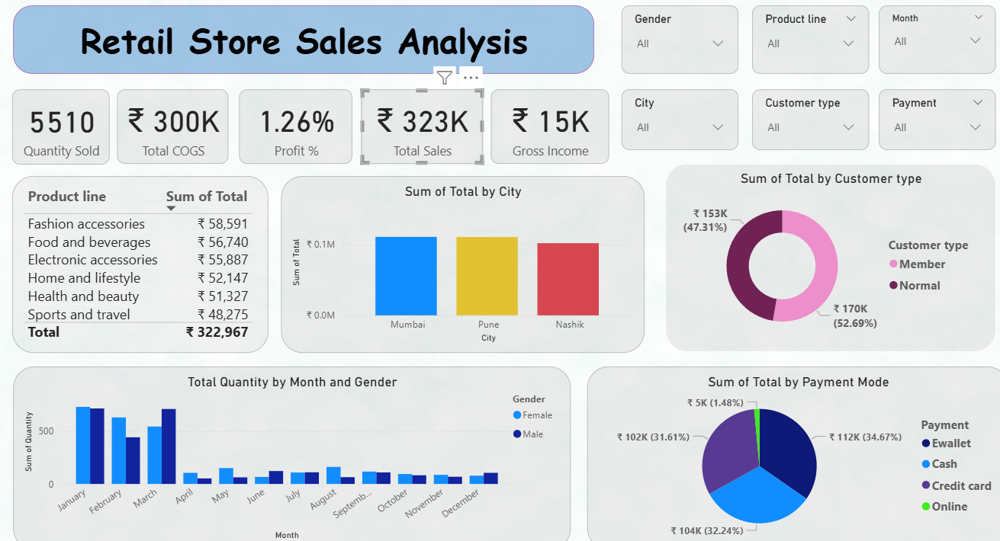
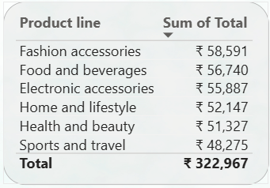
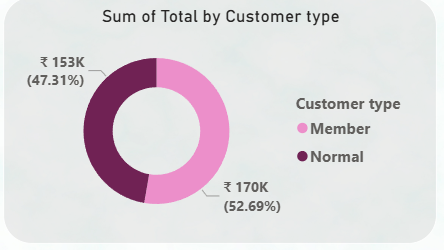
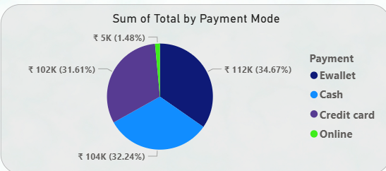
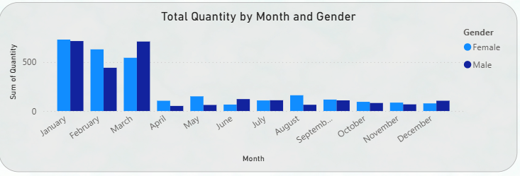

# 🛍️ Retail Business Performance & Profitability Analysis

This project analyzes retail store sales data to uncover insights into product performance, customer behavior, and overall profitability. Using **SQL, Excel, and Power BI**, the analysis covers key performance indicators (KPIs), profit margins, and relationships between sales metrics.

---

## 📑 Abstract
Retail businesses generate huge amounts of data. This project aims to transform raw transactional data into meaningful insights. The study evaluates sales by product line, customer type, payment mode, and city, while also calculating profit margins and exploring the correlation between inventory days and profitability.

---

## 🛠️ Tools Used
- **SQL** – Data import, cleaning null/missing values, and calculating KPIs.  
- **Python (Pandas, NumPy, Matplotlib)** – Correlation analysis between inventory days and profitability.  
- **Excel** – Initial cleaning, pivot analysis, and preprocessing.  
- **Power BI** – Interactive dashboards and data visualization.  

---

## 🔎 Steps Involved
1. **Data Cleaning & Preparation**  
   - Removed null/missing values in Date, Product Line, COGS, Gross Income.  
   - Standardized product categories and payment methods.  

2. **SQL Analysis**  
   - Calculated **profit margins by category and sub-category**.  
   - Derived KPIs: Quantity Sold, Total Sales, Gross Income, Profit %.  

3. **Power BI Dashboard**  
   - KPIs (Quantity Sold, Total COGS, Total Sales, Gross Income, Profit %).  
   - Breakdown by **City, Product Line, Customer Type, Gender, Payment Mode**.  
   - Trends in sales quantity by **Month and Gender**.  

---

## 📊 Dashboard Screenshots

### Overall Dashboard

### Sales by Product Line

### Sales by Customer Type & Payment Mode

### Sales by Month and Gender

---

## ✅ Conclusion
- **Fashion Accessories** and **Food & Beverages** are the top-performing categories.  
- **Normal customers (52.69%)** purchase slightly more than **Members**.  
- **Credit Card (34.67%)** is the most preferred payment mode.  
- Female customers dominate sales in most months, especially in January, March, and April.  
- Correlation analysis reveals how **inventory days impact profitability**, helping retailers optimize stock management.  

---

## 🚀 Future Enhancements
- Predictive analysis for sales forecasting.  
- Advanced customer segmentation for targeted promotions.  
- Integration with real-time sales data streams.  
